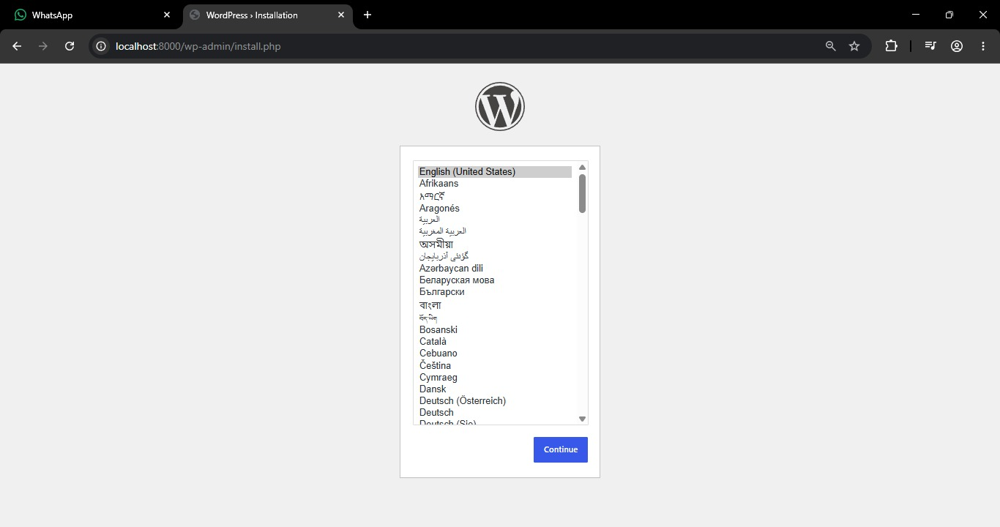
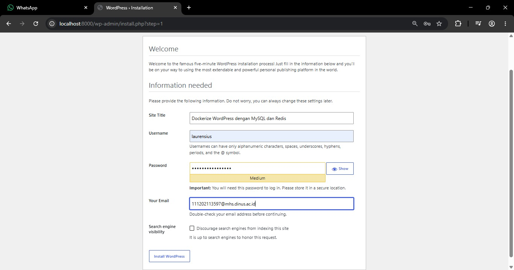
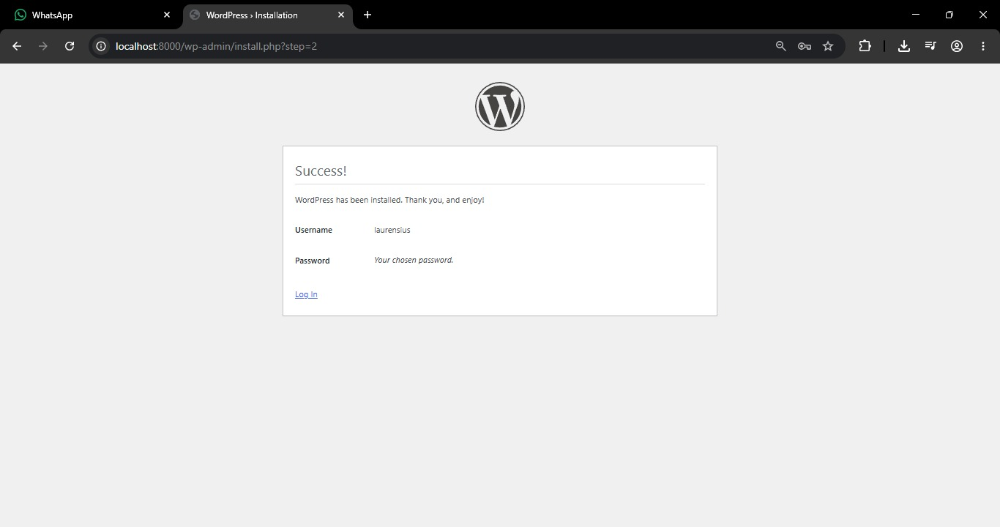
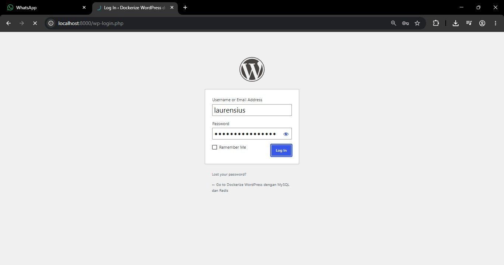
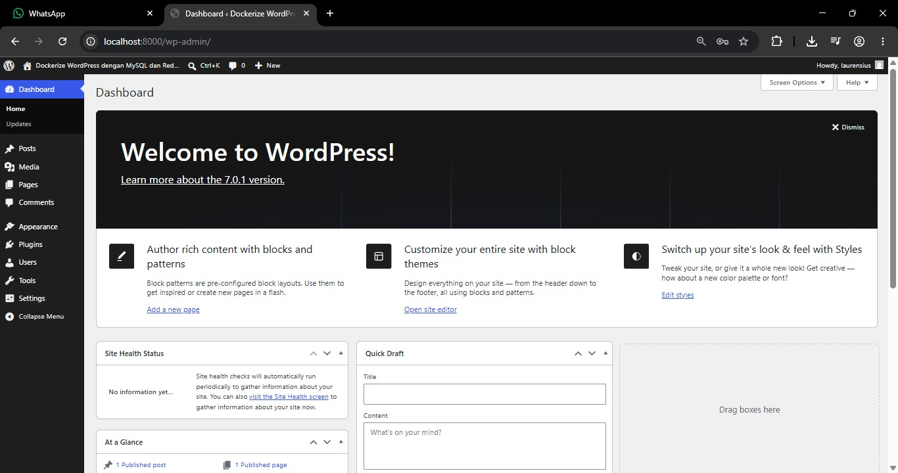
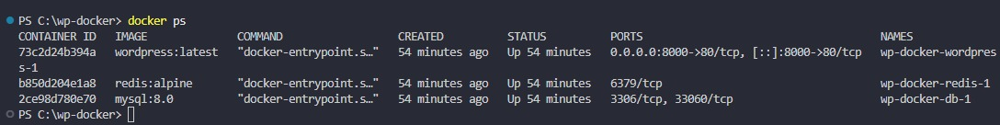
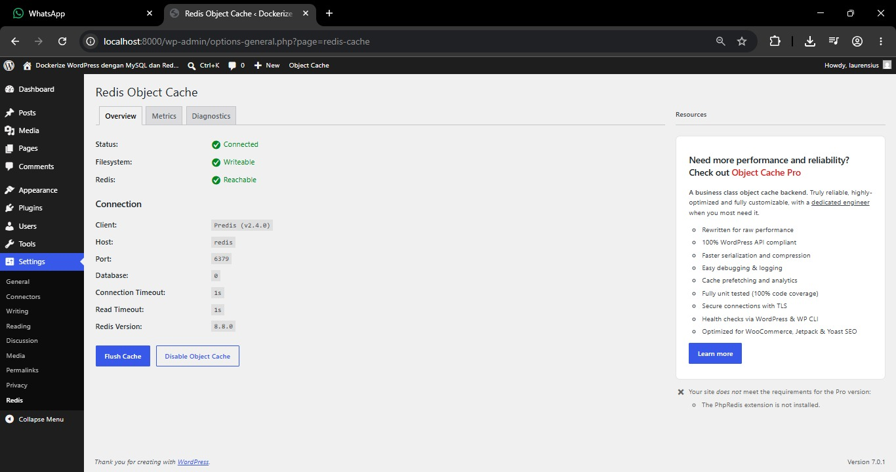
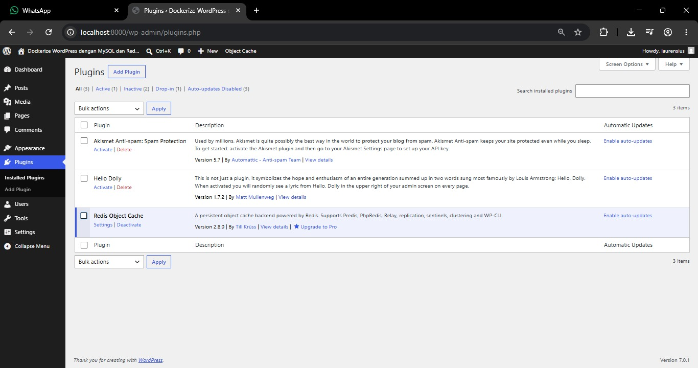

Dockerize WordPress dengan MySQL dan Redis

## WordPress installation page

## WordPress Dashboard

## Containers Running

## Redis Object cache

## Kenapa perlu volume untuk MySQL?
-> Agar data situs tidak hilang saat container dimatikan atau di restart (penyimpanan data yang permanen).
## Apa fungsi depends_on?
-> Mengatur urutan menyala. Memastikan MySQL dan Redis sudah siap beroperasi lebih dulu sebelum WordPress menyala, agar situs tidak mengalami error koneksi.
## Bagaimana cara WordPress container connect ke MySQL?
-> Melalui DNS internal Docker. WordPress cukup memanggil nama layanan `db` (seperti yang ditulis di compose), dan Docker otomatis menghubungkannya ke alamat IP container MySQL tersebut.
## Apa keuntungan pakai Redis untuk WordPress?
-> Redis menyimpan data yang sering diakses ke dalam RAM (Cache). Loading web menjadi sangat cepat dan meringankan beban server karena WordPress tidak perlu terus-menerus membaca data dari database yang lambat.
